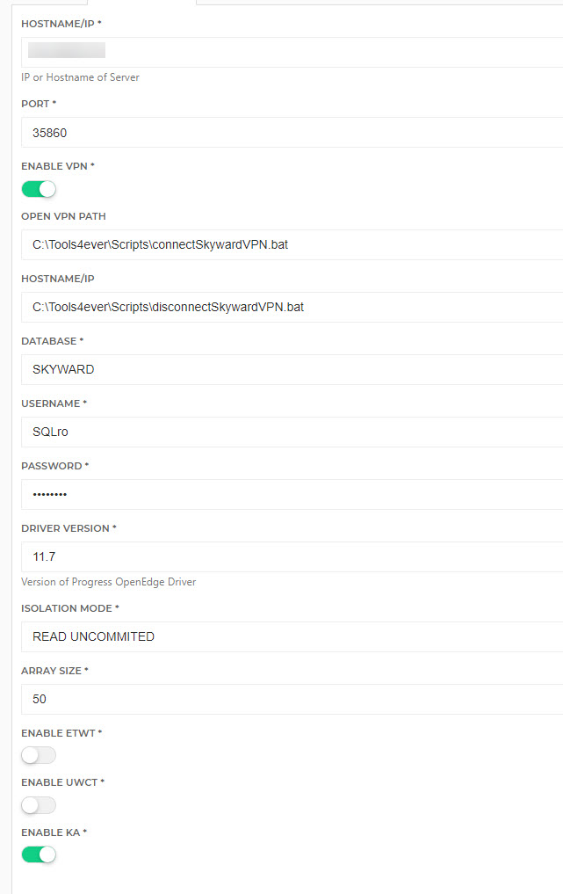

# HelloID-Conn-Prov-Source-Skyward-SMS2.0-Students

| :information_source: Information |
|:---------------------------|
| This repository contains the connector and configuration code only. The implementer is responsible to acquire the connection details such as username, password, certificate, etc. You might even need to sign a contract or agreement with the supplier before implementing this connector. Please contact the client's application manager to coordinate the connector requirements.       |
<br />
<p align="center"> 
  
</p>
<br />
HelloID Provisioning Source Connector for Skyward SMS 2.0

<!-- TABLE OF CONTENTS -->
## Table of Contents
* [Getting Started](#getting-started)
* [Requirements](#Requirements)
* [Setup the PowerShell connector](#setup-the-powershell-connector)
* [Sample VPN Scripts](#sample-vpn-scripts)

<!-- GETTING STARTED -->
## Getting Started
By using this connector you will have the ability to import data into HelloID:
* Student Demographics
* Student School Enrollments

## Requirements
- Progress OpenEdge Driver 11.7+ (ODBC)


## Setup the PowerShell connector
1. Add a new 'Source System' to HelloID and make sure to import all the necessary files.

    - [ ] configuration.json
    - [ ] persons.ps1
    - [ ] departments.ps1
    - [ ] personMapping.json
    - [ ] contractMapping.json


2. Fill in the required fields on the 'Configuration' tab.


* Hostname/IP
  * Hostname or IP of the database
* Port
* Enable VPN
  * If your hosting provider requires VPN connectivity to access the database you can enable it here
* Open VPN Path
  * Path of script to start vpn
* Close VPN Path
  * Path of script to close vpn
* Database
  * Name of Skyward Database
* Username
* Password
* Driver Version
  * Version of the Progress OpenEdge Drive
* Isolation Mode
  * Always suggested to be "READ UNCOMMITED"
* Array Size
* Enable ETWT
* Enable UWCT
* Enable KA

## Sample VPN Scripts
### Open VPN
```
cd C:\Tools4ever\Scripts
taskkill /S localhost /im vpncli.exe /f /t
taskkill /S localhost /im vpnui.exe /f /t
"c:\program files (x86)\Cisco\Cisco AnyConnect Secure Mobility Client\vpncli.exe" -s < connect.txt
```
### Close VPN
```
cd C:\Tools4ever\Scripts
"c:\program files (x86)\Cisco\Cisco AnyConnect Secure Mobility Client\vpncli.exe" disconnect
```
### VPN Client Config
```
connect vpn-1.iscorp.com
idofgroup
thisismusername
thisismypassword
y
quit
```

# HelloID Docs
The official HelloID documentation can be found at: https://docs.helloid.com/
